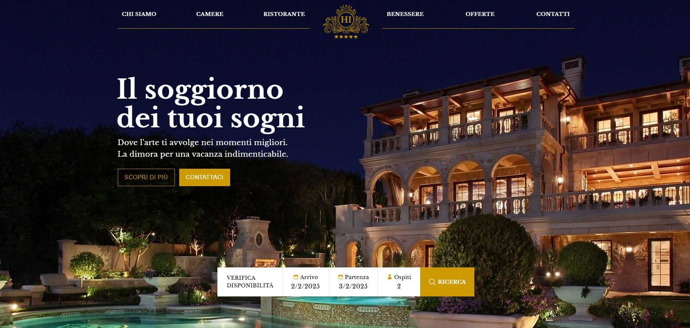
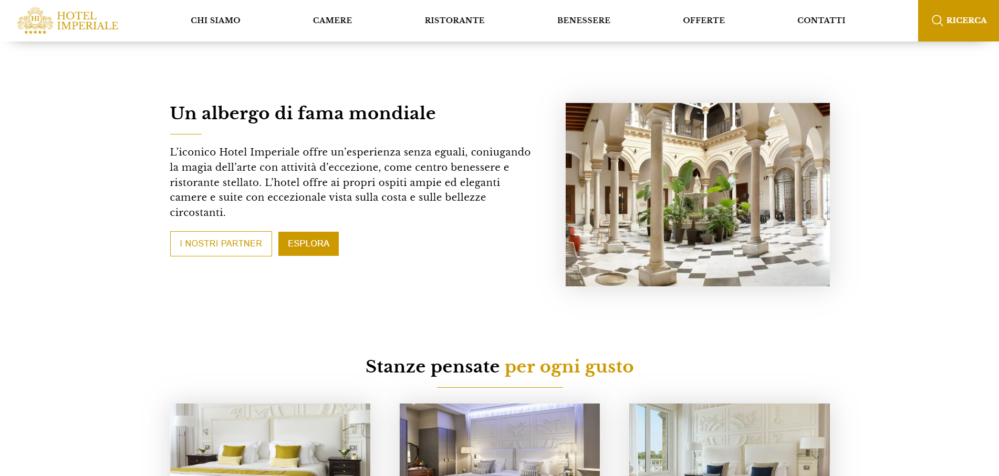
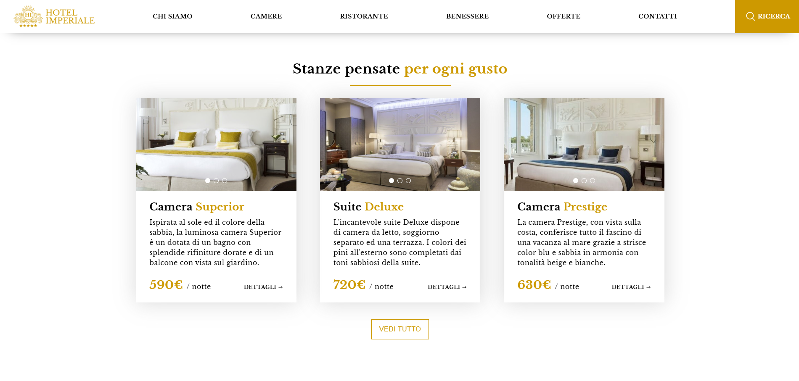
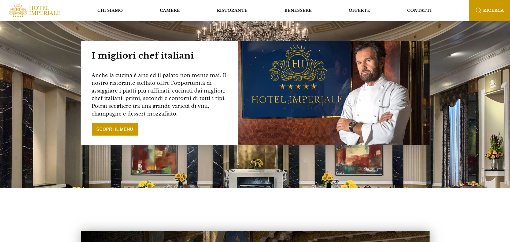
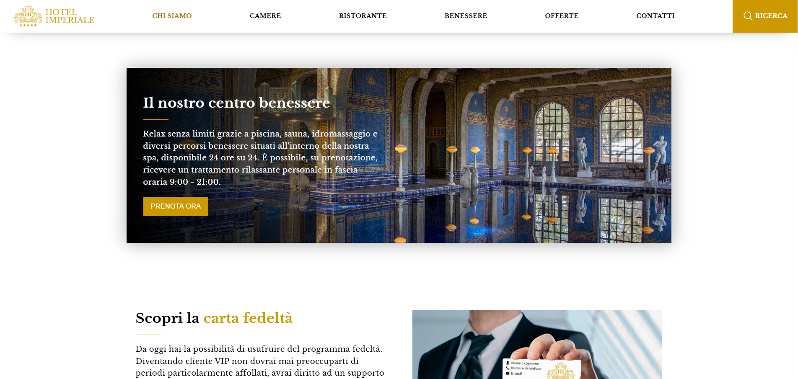
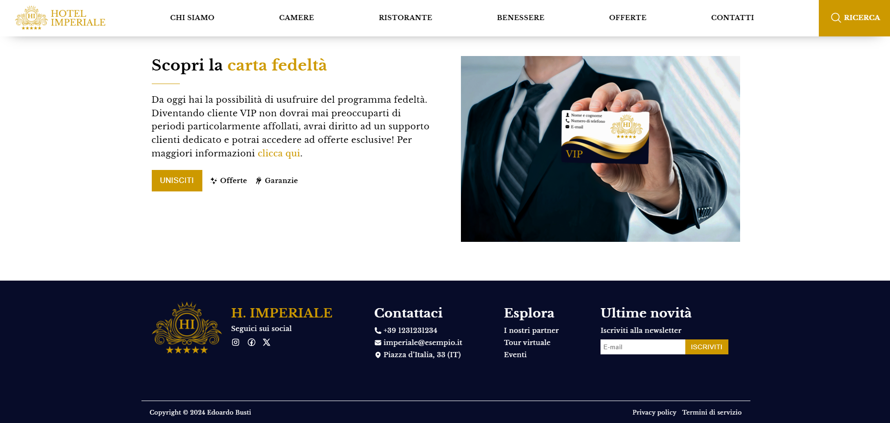

# 🏨 Luxury Hotel Website

This project showcases a fictional Italian luxury hotel website I designed and developed, demonstrating my skills in creating pixel-perfect,  
responsive, and visually harmonious landing pages. ✨

## 🌟 Features

- **Pixel-perfect design**: Every detail is crafted with precision to ensure a flawless user experience.
- **Responsive layout**: Optimized for all screen sizes, including desktop, tablet, and mobile devices.
- **Custom date picker**: A custom feature implemented to showcase my skills in DOM manipulation.
- **High-quality visuals**: Designed and enhanced in Photoshop.

## 🛠 Tech Stack

- **HTML5**
- **CSS3**
- **JavaScript ES6+**
- **Photoshop**

## 🌐 Live Version on Netlify

You can view the live version of the project on **Netlify**:

- **🚀 Live Demo URL**: [https://hotel-imperiale.netlify.app](https://hotel-imperiale.netlify.app)

## 📸 Screenshots

### Hero Section

### About Section

### Rooms Section

### Restaurant Section

### Spa Section

### VIP Section

